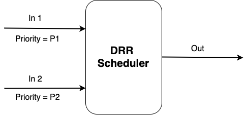
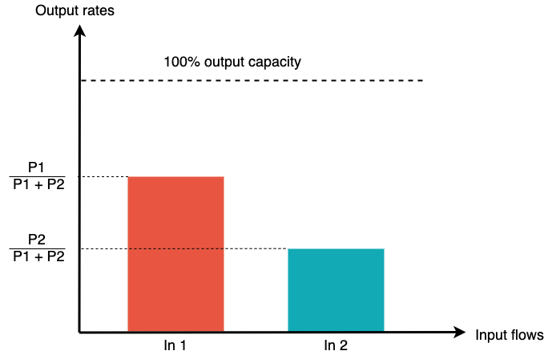

# Deficit Round Robin channels scheduler

[![GoDoc][GoDoc-Image]][GoDoc-Url]
[![License][License-Image]][License-Url]
[![FOSSA Status][FOSSA-Image]][FOSSA-Url]
[![Build Status][Build-Image]][Build-Url]
[![Coverage Status][Coverage-Image]][Coverage-Url]
[![Go Report Card][Report-Url]][Report-Image]

[GoDoc-Url]: https://godoc.org/github.com/bigmikes/drr
[GoDoc-Image]: https://godoc.org/github.com/bigmikes/drr?status.svg
[License-Url]: https://opensource.org/licenses/MIT
[License-Image]: https://img.shields.io/badge/License-MIT-yellow.svg
[FOSSA-Url]: https://app.fossa.io/projects/git%2Bgithub.com%2Fbigmikes%2Fdrr?ref=badge_shield
[FOSSA-Image]: https://app.fossa.io/api/projects/git%2Bgithub.com%2Fbigmikes%2Fdrr.svg?type=shield
[Build-Url]: https://travis-ci.org/bigmikes/drr
[Build-Image]: https://travis-ci.org/bigmikes/drr.svg?branch=master
[Coverage-Url]: https://coveralls.io/github/bigmikes/drr
[Coverage-Image]: https://coveralls.io/repos/github/bigmikes/drr/badge.svg
[Report-Url]: https://goreportcard.com/badge/github.com/bigmikes/drr
[Report-Image]: https://goreportcard.com/report/github.com/bigmikes/drr

## Introduction
Sometimes, certain messages are more important than others. The drr package provides a generic implementation of [Deficit Round Robin scheduler](https://en.wikipedia.org/wiki/Deficit_round_robin) for Go channels. Through this package, developer can merge multiple input channels into a single output one by enforcing different input rates. 

## Quick overview on DRR theory
Let's assume you have one single worker goroutine that must handle all the incoming requests. Let's also assume that there are two sources of those requests implemented through a couple of channels. Channel _In_1_ carries the requests with higher priority _P1_, while channel _In_2_ carries the requests with lower priority _P2_.

<p align="center">
  
</p>

What we observe from channel _Out_ is that input flows _In_1_ and _In_2_ share the output's capacity according to their priorities. That is, flow _In_1_ takes  fraction of output capacity. While flow _In_2_ uses the remaining fraction, .

<p align="center">
  
</p>

DRR scheduling algorithm does not take into account empty flows (i.e. those that do not have anything to transmit). Therefore, the output capacity is shared among all the non-empty input flows.

## API Documentation
Documentation can be found [here](https://pkg.go.dev/github.com/bigmikes/drr?tab=doc).

## Example
```Go
import (
	"context"
	"fmt"

	"github.com/bigmikes/drr"
)

func sourceRequests(s string) <-chan interface{} {
	inChan := make(chan interface{}, 5)
	go func() {
		defer close(inChan)
		for i := 0; i < 5; i++ {
			inChan <- s
		}
	}()
	return inChan
}

func main() {
	// Set output channel and create DRR scheduler.
	outputChan := make(chan interface{}, 5)
	drr, err := drr.NewDRR(outputChan)
	if err != nil {
		panic(err)
	}

	// Register two input channels with priority 3 and 2 respectively.
	sourceChan1 := sourceRequests("req1")
	drr.Input(3, sourceChan1)
	sourceChan2 := sourceRequests("req2")
	drr.Input(2, sourceChan2)

	// Start DRR
	drr.Start(context.Background())

	// Consume values from output channels.
	// Expected rates are 3/5 for channel with priority 3
	// and 2/5 for channel with priority 2.
	for out := range outputChan {
		fmt.Println(out)
	}
}

// Output:
// req1
// req1
// req1
// req2
// req2
// req1
// req1
// req2
// req2
// req2
```

## License 
The drr package is licensed under the MIT License. Please see the LICENSE file for details.

## Contributing and bug reports
This package surely needs your help and feedbacks. You are welcome to open a new issue [here on GitHub](https://github.com/bigmikes/drr/issues).
